# Digital Safety & Wellness Audit

September 18, 2026. Baseline: `a154484`. Scope: the complete original repository, every line of its 5,163-line HTML source, and the learner experience captured during this audit.

## Anti-Patterns Verdict

**Fail: recognizable template patterns, not evidence of AI authorship.** The repeated rounded cards, cards inside lesson cards, decorative progress/metadata pills, and colored side-stripe callouts make a student learning experience look like a generic dashboard. The current serif/sans pairing and navy/teal palette are coherent, but do not establish a distinctive learning product. Screenshots 1-4 and 6 show these patterns.

This PR is not a visual redesign. Brand personality and desired tone still need confirmation from the team. Existing typography, colors, lessons, and page structure are largely preserved.

## What the Product Does

This is a browser-only student curriculum, not a hosted learning-management system. Its existing scenarios use college settings and California-specific rights content.

The learner enters a name, completes four ordered curriculum modules, passes each mini-test at 80%, then passes the final exam to unlock a printable certificate. Multiple-choice and multiselect questions permit one retry; true/false questions have one attempt. This measures guided learning, not first-attempt mastery.

| Curriculum module | Existing learning goal | Current activities |
| --- | --- | --- |
| Scams & Social Engineering | Recognize manipulation and verify independently | Scenarios, eight-round domain practice, mini-test |
| Social Media & Well-being | Understand footprints, privacy, recommendations, and manipulation | Nineteen-item footprint reflection, scenarios, mini-test |
| Account Security | Understand unique passwords, MFA, and recovery | Password practice lab, scenarios, mini-test |
| Reporting & Rights | Recognize incidents and understand response/reporting options | Scenarios, evidence-preservation material, mini-test |

There are **57 top-level steps, 22 practice questions, 32 mini-test questions, and 20 final-exam questions**. Two of the practice questions previously existed in the data but never rendered. No accounts, backend, analytics, saved progress, genuine branching story, leaderboard, or instructor reporting currently exist.

The important product constraint is distribution: a learner or instructor must still be able to download **one HTML file and open it without installing tools**.

## Health Score

These are review scores using the requested 0-4 rubric, not Lighthouse scores or a WCAG certification.

| Dimension | Baseline | After this PR | Key finding |
| --- | ---: | ---: | --- |
| Accessibility | 1 | 2 | Native states, labels, focus, and reduced motion improved; text contrast remains below AA in several places |
| Performance | 2 | 3 | Two remote PDF scripts removed; no framework or runtime dependencies added |
| Responsive design | 2 | 3 | Certificate now grows on mobile; controls and headings wrap; broader device/zoom testing remains |
| Theming | 2 | 2 | Tokens exist, but inline colors and component styling are widespread |
| Anti-patterns | 1 | 1 | The visual redesign is intentionally deferred |
| **Total** | **8/20, Poor** | **11/20, Acceptable** | Functionality improved; design and content work remains |

**13 technical/product findings: P0: 0, P1: 7, P2: 6, P3: 0.** No complete application outage was found; the assessment-integrity problems require fixing before learner release. The research-review queue below is separate; those claims have not been fact-checked in this engineering pass.

## Findings

### 1. [P1] Learner-visible shortcuts manufacture completion

- **Location:** baseline HTML lines 1344-1380, 3013-3032, 4924; replaced by guards in `src/app.js`.
- **Category:** product correctness.
- **Impact/evidence:** in the actual baseline browser, Dev Mode -> Final Exam -> DEV: Last Q -> two wrong answers produced **95% and a certificate with zero completed modules**. Screenshots 2, 7, 7b, and 8 document the flow.
- **Resolution:** removed the development panel and score fabrication. Module access, final-exam entry, module completion, and certificate display check actual course state.
- **Standard:** application completion contract, not an anti-cheat guarantee.
- **Command:** `/harden`. **Status: fixed.** A local, editable HTML file still cannot be a tamper-proof examination.

### 2. [P1] Two Module 2 questions silently disappear

- **Location:** baseline HTML lines 2220-2232 and 2293-2305; `src/curriculum/module-2.js`, `src/course.js:41`.
- **Category:** product correctness.
- **Impact/evidence:** each missing `type` increments progress but leaves the preceding question on screen; another Continue skips the unseen question.
- **Resolution:** restored the two `type: 'question'` fields and added build-time validation of step types, required content, answer shapes, activity data, and final-exam module references.
- **Standard:** required learning content must be reachable.
- **Command:** `/harden`. **Status: fixed.** Screenshot 9 shows one of the restored questions.

### 3. [P1] Three grading implementations disagree

- **Location:** baseline HTML lines 4437-5052; `src/course.js:109`, shared rendering in `src/app.js`.
- **Category:** product correctness.
- **Impact/evidence:** mini-tests allow a wrong true/false answer followed by the only remaining answer for full credit. All five final-exam multiselect questions accept selecting every option and submitting twice, because incorrect choices are silently removed after the first submission.
- **Resolution:** one Assessment implementation controls selection, retries, locked/rejected choices, recording, advancement, and results in practice, mini-tests, and the final. Wrong multiselect choices must be explicitly removed. Duplicate submissions cannot add credit.
- **Standard:** consistent assessment rules and completion contract.
- **Command:** `/harden`. **Status: fixed and regression-tested.**

### 4. [P1] Visual answer state is not reliable keyboard/AT state

- **Location:** baseline HTML lines 1267, 3969, 4443-4591, 4637-4788, 4895-5034.
- **Category:** accessibility.
- **Impact/evidence:** `pointer-events: none` does not disable keyboard activation; selected multiselect choices have no programmatic state. Name/password fields lack explicit labels, the eye control lacks a useful name, and replacing screens loses reading focus. Footprint checkbox names also change when tooltip text appears.
- **Resolution:** native `disabled`, `aria-pressed`, labeled fields, stable checkbox names, named password visibility control, status regions, meaningful headings, a skip link, and predictable screen focus. Removed inline handlers in favor of delegated native events.
- **Standard:** WCAG 1.3.1, 2.1.1, 2.4.3, 4.1.2, 4.1.3.
- **Command:** `/harden`. **Status: improved; screen-reader verification remains.**

### 5. [P1] Small supporting text lacks contrast

- **Location:** `src/styles.css` color tokens and muted text rules; inline activity styling; screenshots 1, 2, 4, and 6.
- **Category:** accessibility/theming.
- **Impact/evidence:** calculated sRGB contrast: `#718096` on white **4.02:1**, on `#f7f4ef` **3.66:1**; placeholder `#c4c9d4` on `#fdfcfa` **1.62:1**; white on the gold certificate button **2.76:1**. These normal-size active text examples do not reach 4.5:1. Disabled controls are not counted as contrast failures.
- **Recommendation:** define accessible muted/action text tokens and verify all activity states against their actual backgrounds. Do not solve this only on the entry screen.
- **Standard:** WCAG 1.4.3.
- **Command:** `/colorize`. **Status: deferred to the design pass.**

### 6. [P1] Mobile certificate clips actual content

- **Location:** baseline HTML lines 1033-1160 and 1189-1193; `src/styles.css` certificate/mobile/print rules.
- **Category:** responsive design.
- **Impact/evidence:** at 390px, the 480px-tall certificate clips its seal and completion date. The browser rectangle check confirms both extend outside the overflow-hidden certificate. Screenshot 8 shows the result.
- **Resolution:** normal document flow for the mobile certificate, wrapping for long names/actions, and a separate landscape print layout.
- **Standard:** WCAG 1.4.10; usable completion output.
- **Command:** `/adapt`. **Status: fixed; final browser/print evidence recorded below.**

### 7. [P2] Learner text can become HTML in password feedback

- **Location:** baseline HTML lines 4156-4161 and 4312-4321; `src/activities.js:803`.
- **Category:** input handling.
- **Impact/evidence:** a name fragment is interpolated into `innerHTML` when a matching practice password is entered. This is a source-confirmed injection sink requiring controlled local input, not a demonstrated remote attack.
- **Resolution:** escape the name fragment, retain `textContent` for names elsewhere, and bound the practice input. Repository-authored rich lesson HTML remains trusted content.
- **Standard:** treat learner input as text.
- **Command:** `/harden`. **Status: fixed; escaping regression check included.**

### 8. [P1] Certificate export requires unrelated startup downloads

- **Location:** baseline HTML lines 1229-1231 and 5123-5155; `src/shell.html`, native print action in `src/app.js`.
- **Category:** performance/reliability.
- **Impact/evidence:** every learner loads html2canvas and jsPDF before reaching the certificate. Their current pinned files contain **198,689 + 364,463 = 563,152 decoded JS bytes**. With the libraries unavailable, the original export only reports that tools are still loading.
- **Resolution:** reuse browser printing and existing print CSS. The button now opens a **Print / Save PDF** dialog; it no longer downloads an automatically named raster PDF.
- **Standard:** the documented offline distribution contract.
- **Command:** `/optimize`. **Status: fixed.** These byte counts are not compressed transfer sizes or a measured latency improvement.

### 9. [P2] Hidden views retain activity content

- **Location:** baseline `goToHub()`/`showHub()` at lines 3152-3165; `src/app.js:19`.
- **Category:** performance/privacy.
- **Impact/evidence:** the original navigation hides the module but leaves its iframe and password input in the DOM. Hiding media is not an explicit playback teardown. The audit did not time continued audio.
- **Resolution:** clear inactive render roots and transient activity state when changing views. Re-entering a module still restarts it, matching the original behavior.
- **Command:** `/harden`. **Status: fixed.**

### 10. [P2] Displayed counts drift from the content

- **Location:** baseline HTML lines 1313 and 3500-3587.
- **Category:** product clarity.
- **Impact/evidence:** the hub advertises 22 final questions; the exam actually has 20. Footprint results say “of 16” despite 19 available items.
- **Resolution:** derive exam, scenario, mini-test, domain, and footprint counts from the underlying arrays.
- **Command:** `/clarify`. **Status: fixed.**

### 11. [P2] Leaving or closing the course loses work

- **Location:** original in-memory state and module entry; preserved in `src/app.js`.
- **Category:** product flow.
- **Impact/evidence:** closing/reloading discards all progress, and returning to an unfinished module restarts its steps. The advertised module/exam times sum to roughly 69 minutes. This can conflict with classroom-sized sessions.
- **Recommendation:** confirm how the class uses the course before adding persistence. A later local-only resume option needs clear shared-device behavior and an explicit reset; no account system is justified by the current brief.
- **Command:** `/shape`. **Status: intentionally deferred and documented in README.**

### 12. [P2] Reading and decoration dominate the practice

- **Location:** screenshots 1-4 and 6; lesson renderers and curriculum bodies.
- **Category:** anti-patterns/product design.
- **Impact/evidence:** large introductory framing, nested cards, repeated headings, and long explanatory blocks delay the next learner action. “Branching” questions currently provide feedback and advance linearly; they are not branching gameplay. The repo has no scenario images, only optional image slots.
- **Recommendation:** make the next design phase task-first: a believable scam artifact, one decision, evidence-based feedback, then reflection. Use real approved mock assets, not decorative dashboard metrics.
- **Command:** `/distill`, then `/shape`. **Status: deferred; no speculative game engine added.**

### 13. [P2] Tokens do not cover the full interface

- **Location:** `src/styles.css`, inline styles in `src/activities.js`, and rich content in curriculum files.
- **Category:** theming.
- **Impact/evidence:** the root palette is useful, but activity colors, surfaces, spacing, and text treatment are repeated inside templates and content. Changing the palette alone would not update the whole experience.
- **Recommendation:** extract the repeated visual rules while doing the agreed redesign, starting with readable text, question state, and activity surfaces. Dark mode is not an existing requirement and is not proposed here.
- **Command:** `/colorize`, then `/polish`. **Status: deferred.**

## Systemic Patterns

- Unchecked authoring data caused both missing learning steps and mismatched counts. A shared validation pass addresses the cause rather than hiding individual failures.
- Repeated grading implementations made partial fixes likely. The history contains fixes applied to one context but not its siblings.
- Styling inside content and activity templates makes a design change span unrelated files. The authoring split helps ownership, but does not replace the next design-token cleanup.

## Positive Findings

- The university, internship, payment, and account scenarios give the course a concrete student context.
- Native buttons and checkboxes provide a useful foundation for keyboard access.
- The explicit instruction not to enter a real password should be retained.
- Immediate explanations, retries, and progress indicators support guided learning when their behavior is consistent.
- One-file distribution and the absence of accounts or a backend keep classroom setup modest.

## Captured Product Flow

All screenshots are from this audit run, saved and inspected locally. The baseline's existing developer toggle was used to reach later modules and explicitly reproduce the bypass; those captures are **not** evidence of legitimate baseline completion. Screenshots 9 onward are from the revised learner build with external requests blocked, so they show fallback fonts.

### 1. Enter the course: understandable, accessibility gaps
Clear purpose and certificate motivation. The original field relies on placeholder text and hides its error until submission.

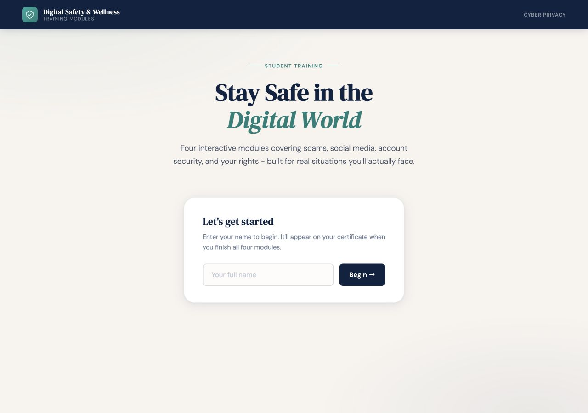

### 2. Choose a module: visible progression, release-blocking bypass
The four-topic curriculum is easy to scan, but a development control contradicts ordered completion. Dense metadata competes with the primary action.

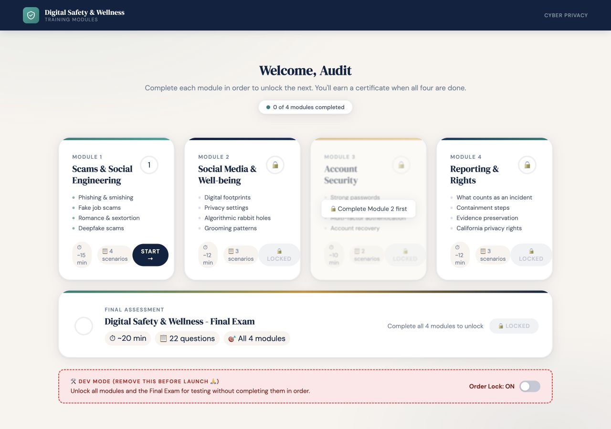

### 3. Read a scenario: relevant context, text-heavy presentation
The internship scam fits the existing college setting. The next design should let students inspect the message itself rather than only read about it.

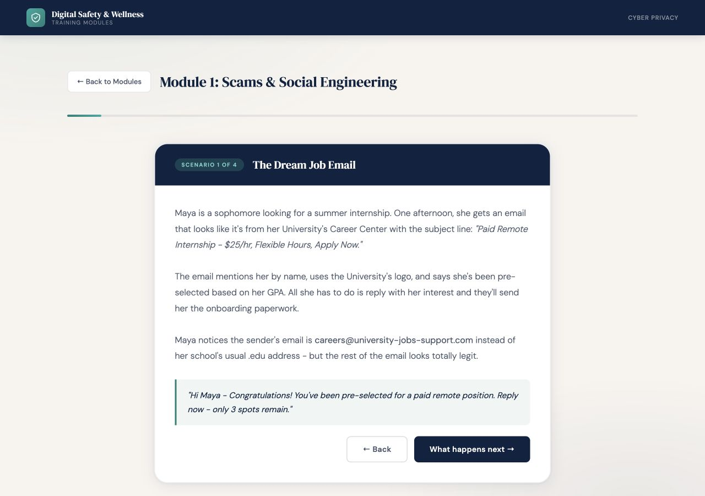

### 4. Practice domain recognition: a feasible game foundation
Already has rounds, choices, feedback, and a score. The “legitimate” wording needs research review: an address alone is not a complete authenticity check.

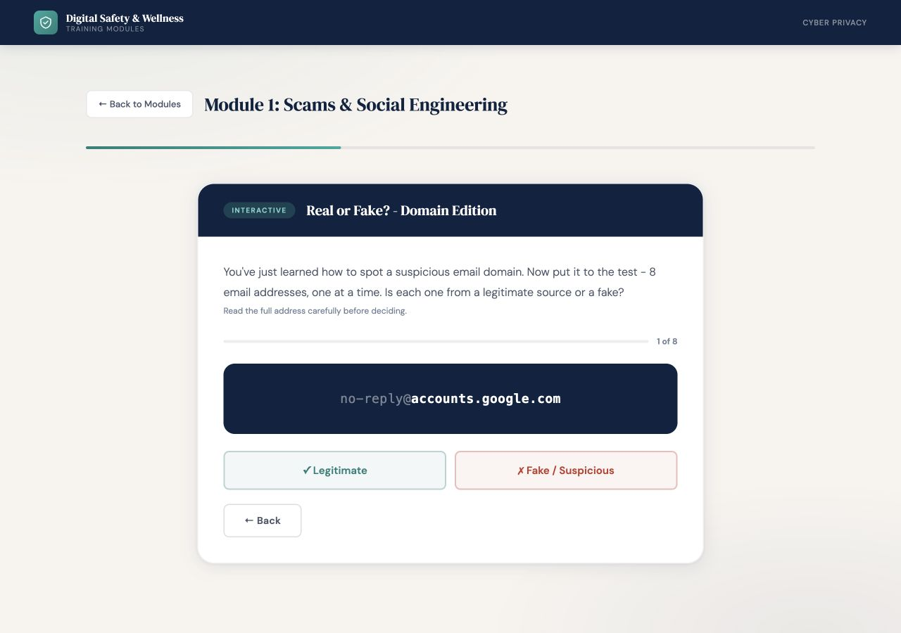

### 5. Reflect on a footprint: useful participation, oversized/uncalibrated framing
The native checkboxes work; the page is long, the original count is wrong, and the weights are not a validated risk model.

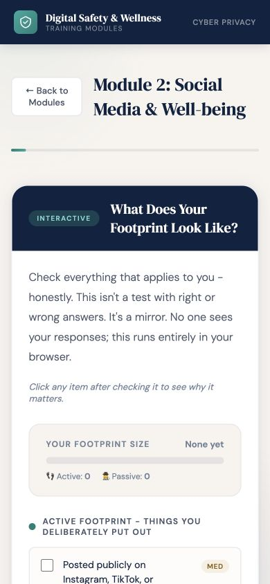

### 6. Try a practice password: responsive feedback, misleading precision risk
The explicit warning not to use a real password should remain. The custom score and crack-time language are a curriculum-review priority.

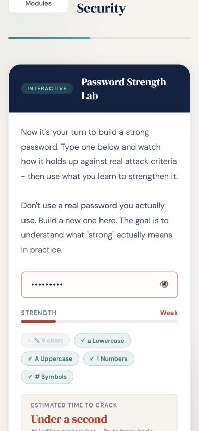

### 7. Take the exam: completion result is untrustworthy in the baseline
The visible shortcut skips to question 20. Two incorrect answers still result in 95% because 19 answers were fabricated.

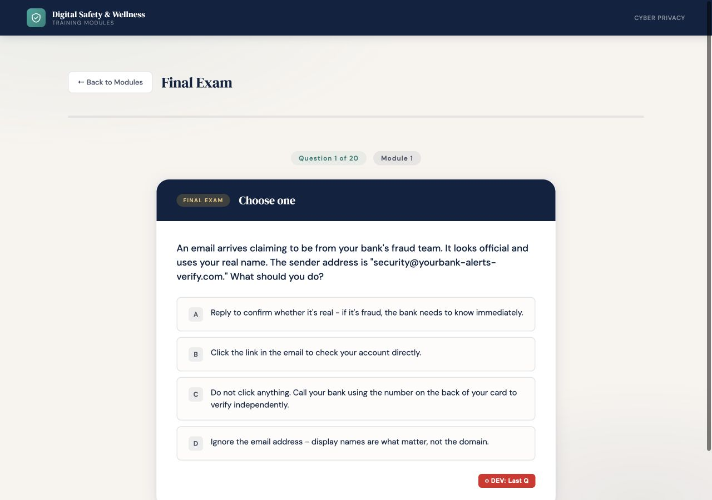
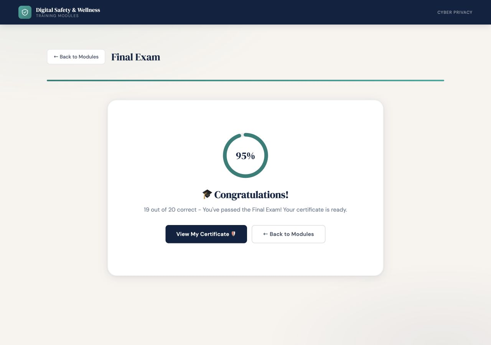

### 8. Receive a certificate: motivating output, clipped on mobile
This baseline certificate came from the bypass, not module completion. The seal and date are clipped at 390px.

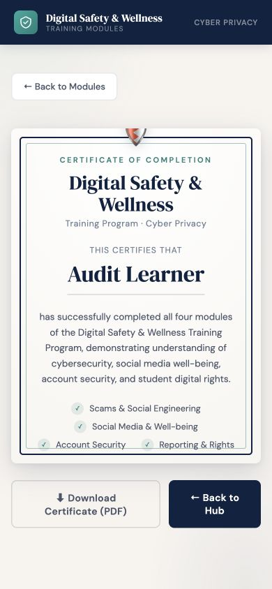

### 9. Restored practice question: reachable and keyboard-selectable
One of the two previously skipped Module 2 questions now renders. Space toggles the choice and its `aria-pressed` state.

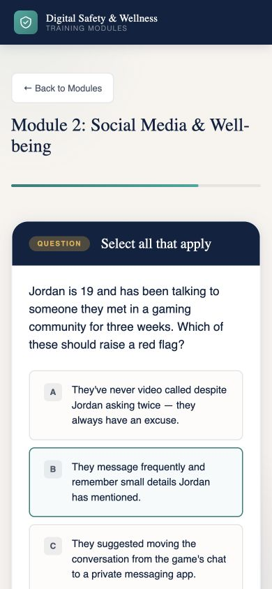

### 10. Revised certificate: earned through the complete course
The actual UI completed all four mini-tests and the final. A long synthetic name fits without clipping; at 320px the certificate grows to its content rather than hiding its date. This desktop capture shows the whole revised certificate.

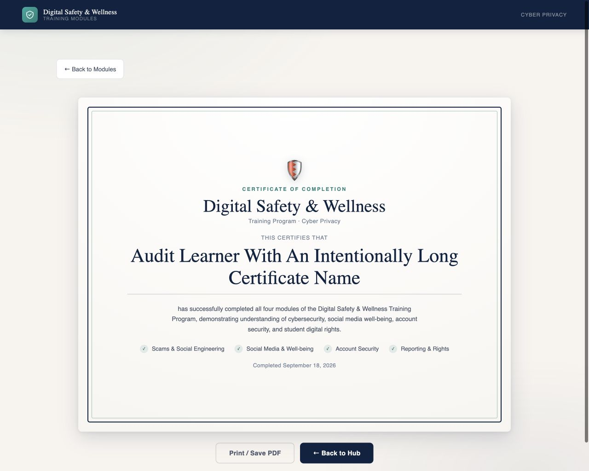

## Architecture Changes

Recent history concentrated curriculum edits, renderer changes, and grading fixes in the same HTML file. The refactor addresses actual friction from those edits, rather than migrating frameworks.

| Deepened module | Interface and seam | Locality and leverage |
| --- | --- | --- |
| Curriculum authoring | Plain objects enter a validated course-data seam | One file per curriculum module; missing types or invalid answer data stop distribution |
| Assessment | `Assessment` owns selection, submit, advance, and result behavior | One implementation serves practice, all mini-tests, and the final; tests use the same interface as the player |
| Learner distribution | One build command validates and inlines the sources | Maintainers edit small sources; learners still receive one standalone HTML file |
| Certificate output | Native browser print interface | Delete the canvas/PDF pipeline; no custom interchangeable export adapter hierarchy |

The deletion test supports the Assessment module: deleting it would redistribute grading rules across three callers. A hypothetical game-plugin seam, CMS adapter, or backend would add no present leverage, so none was built.

The visual before/after architecture report was generated separately in the OS temporary directory, as requested by the architecture skill. This document retains the decisions for the PR.

## Ponytail Audit

These were identified in the audit and implemented in the separate refactor pass:

- `shrink:` Three question controllers and feedback implementations. Replacement: one Assessment and one rendering path. `src/course.js`, `src/app.js`.
- `delete:` Learner-facing development controls and score fabrication. Replacement: nothing in the learner artifact. `src/shell.html`.
- `native:` Canvas-to-PDF capture, scaling, loading, and failure machinery. Replacement: `window.print()`. `src/app.js`.
- `shrink:` Duplicate hub navigation. Replacement: `showHub()` and one view switch. `src/app.js`.
- `native:` Inline hover handlers. Replacement: CSS `:hover` and `:has(input:checked)`. `src/styles.css`.

**net: -420 generated learner-artifact lines, -2 runtime deps.** Repository LOC increases because source, tests, evidence, and the generated download are both committed; moving files is not counted as a performance improvement.

## Curriculum Research Queue

Do not treat the unchanged wording as validated by this PR. The upcoming research document should supply primary sources, applicability, dates, and reviewer approval for each of these areas:

| Module | Review before rewriting |
| --- | --- |
| 1 | The “99%” human-interaction statistic; absolute statements about real emergencies and payment reversibility; address authenticity versus domain similarity; public-suffix exceptions to the “last two parts” rule |
| 2 | Employer-screening statistics; age-dependent platform privacy defaults; platform-specific settings paths; broad claims about browser sync, smart speakers, and algorithms; non-judgmental footprint feedback |
| 3 | Custom strength/crack-time estimates and the tiny embedded common-password list; passphrases versus composition rules; the limitations of different MFA methods; current password-manager recommendations |
| 4 | Current California notification/monitoring requirements and CCPA applicability; campus-specific reporting routes; absolute “evidence first” and “blocking doesn't escalate” statements, which need qualified safety review |

Keep lessons, their practice questions, mini-tests, and final-exam items aligned when changing a claim. Do not make the research review only a copy edit. The legacy password heuristic is explicitly marked in code; a proven estimator or a different educational interaction can be evaluated after the learning objective is agreed.

## Feasible Semester Game Work

**Start with one small extension of the existing domain activity.** It already has the round -> decision -> explanation -> result loop.

1. Choose one learning objective, such as noticing urgency and independently verifying an internship message.
2. Write a small, reviewed set of simulated messages with explanations and source references. Keep the artifacts fictional and avoid collecting real passwords or personal experiences.
3. Extend the current interactive step to show the message and let students choose a safe action or identify evidence. Reuse the assessment rules when the activity is graded.
4. Test it with classmates for understanding, keyboard use, phone layout, and the time required. Add another activity only after the first works.

Research/content ownership can be split by the four curriculum files. One implementation owner can maintain the interaction and tests; design and learner testing can proceed against the same small flow. Team size, available hours, and classroom session length still need confirmation, so no delivery-time estimate is asserted.

Skip accounts, cloud saves, public rankings, multiplayer, elaborate branching, a CMS, and a general-purpose game engine. None is needed to test whether “spot the scam” improves this course.

## Verification and Limits

- Read every original source line and the README; reviewed the recent curriculum/grading history.
- **11/11 Node checks pass**: curriculum shape, retry rules, select-all rejection, repeated submissions, empty/invalid selection, completion threshold, shuffling, escaping, and artifact packaging.
- Build validation and `--check` pass. The download is **258,337 bytes**, down from **279,220 bytes**, with no external runtime scripts.
- Compared **781 original curriculum text fields and all existing answer keys** with the baseline. They are preserved; the two missing question types and video metadata were repaired.
- An independent source/VM review found no new actionable P1/P2 findings. Its synthetic checks are not a substitute for browser testing.
- Baseline browser captures and the 95%-with-zero-modules reproduction are complete.
- Completed the actual revised UI flow: **74 practice/assessment questions, eight domain rounds, all four mini-tests, and the final exam**, then reached the certificate. No application console errors were captured.
- Browser regression probes confirmed that a wrong mini-test true/false answer ends that question and an unchanged select-all final-exam resubmission fails. Both restored Module 2 questions were visited.
- Tested the flow at 390px and then 320px, with no horizontal overflow across the visited screens. Space toggles multiselect choices and their accessible pressed state. The certificate has no clipped children at 320px, including the long synthetic learner name. Desktop certificate checked at 1280x1024.
- External HTTPS requests were blocked during the full learner flow; the core course remained usable without the fonts or optional video. Browser settings were restored afterward.
- Print-only CSS shows the certificate and hides controls. **Actual PDF output/page count remains unverified:** the in-app browser reports `Printing is not available` for its PDF capture command. A normal-browser Save PDF check is still required; no PDF is claimed as generated.

Not covered: real student usability research, a full screen-reader audit, all browsers/devices, text zoom, deployed performance, production Core Web Vitals, legal/safety fact-checking, or anti-cheat security. File-URL navigation was blocked by the audit browser; screenshots use a loopback-only preview serving the course, not a publicly deployed site. The application itself still ships as one inline HTML file.

44px is the project's preferred touch-target size, not a blanket WCAG AA minimum. WCAG 2.2's target-size minimum criterion is 24px with exceptions; the 44px enhanced criterion is AAA. Do not label every smaller control an AA failure.

Reference standards: [WCAG contrast](https://www.w3.org/WAI/WCAG22/Understanding/contrast-minimum.html), [target size minimum](https://www.w3.org/WAI/WCAG22/Understanding/target-size-minimum.html), [status messages](https://www.w3.org/WAI/WCAG22/Understanding/status-messages.html), and [native printing](https://developer.mozilla.org/en-US/docs/Web/API/Window/print).

## Recommended Next Actions

1. **[P1] `/colorize`**: correct muted/action text contrast across the entire course.
2. **[P1] `/clarify`**: revise research-dependent claims after the research document and qualified safety/legal review.
3. **[P1] `/harden`**: verify the new interaction states with assistive technology and preserve regression checks.
4. **[P2] `/shape`**: agree on the first scam-spotting flow and classroom session/resume needs.
5. **[P2] `/distill`**: reduce nested cards, repeated headings, and reading density once the visual direction is approved.
6. **[P2] `/adapt`**: finish the broader browser, device, and text-zoom checks.
7. **[P3] `/polish`**: finish visual consistency after the substantive changes.

You can ask me to run these one at a time, all at once, or in any order you prefer. Re-run `/audit` after fixes to see your score improve.
